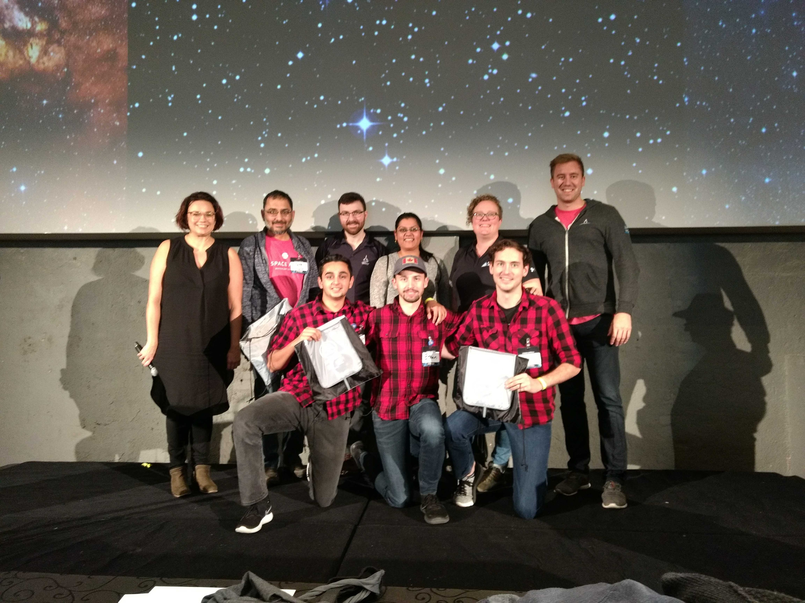

# STRATOSPHERE

### Challenge

This is our solution to the STRATOS challenge

### Team

We are the EH-Team, and we consist of:

- Ethan Elliott: [ethan.elliott@ontariotechu.net](mailto:ethan.elliott@ontariotechu.net)
- Brent Myers: [brent.myers@ontariotechu.net](mailto:brent.myers@ontariotechu.net)
- Anirudh Mungre: [anirudh.mungre@ontariotechu.net](mailto:anirudh.mungre@ontariotechu.net)



### Location

We participated in the Waterloo region chapter of the Space Apps Challenge

### Video Presentation

The video of the presentation is available at: [this link](https://www.youtube.com/watch?v=O4aQaG1UDPk)

### Powerpoint Presentation

The presentation is available in this repository at: [this link](presentation/)

## Code

This repository contains the code for both the interface and the server with micro-service

### Dependencies
1. VueCLI - for the interface
2. NodeJS, ExpressJS, AxiosJS, and Cors - for the server
3. Python3, Flask, and Flask_Cors - for the parsing micro-service

### Install

#### Server

in the root of the server run: 
 
```bash
yarn install
```

#### Micro-Service

in the root of the micro-service folder (server/micro-service) run: 
 
```bash
pip install -r requirements.txt
```

#### Web Interface

in the root of the front-end folder (stratos/) run: 
 
```bash
yarn install
```


### Running the Services

#### Server

in the root of the server run: 
 
```bash
yarn start
```

#### Micro-Service

in the root of the micro-service folder (server/micro-service) run: 
 
```bash
python app.py
```

#### Web Interface

in the root of the front-end folder (stratos/) run: 
 
```bash
yarn serve
```

Once all three are running, STRATOSPHERE will be ready to use!
